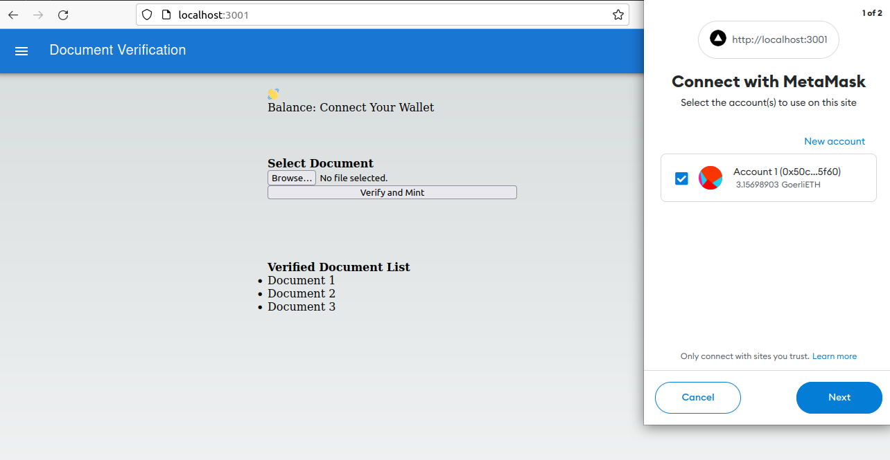
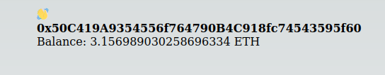
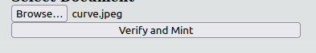
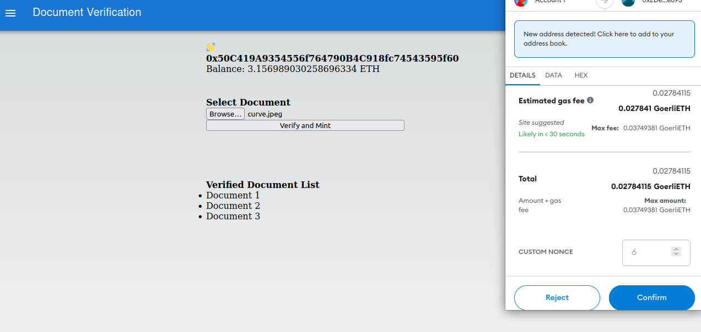
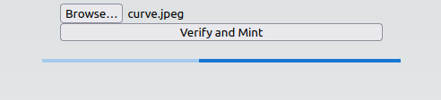
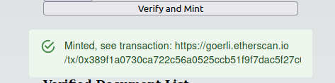
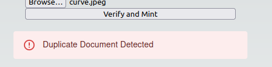

# Asset Verification

## Steps to verify your document:
### 1. Connect your wallet 

### 2. Shows your balance

### 3. Select document to verify

### 4. Sign transaction

### 5. Waiting State 

### 6. If Document is not duplicate

### 7. If Duplicate document identified

